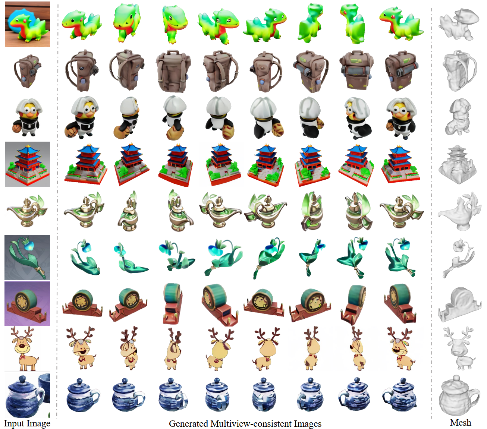

# SyncDreamer
SyncDreamer: Generating Multiview-consistent Images from a Single-view Image

## [Project page](https://liuyuan-pal.github.io/SyncDreamer/) | [Paper](https://arxiv.org/abs/)

Codes will be available by the end of Sep. 2023.
