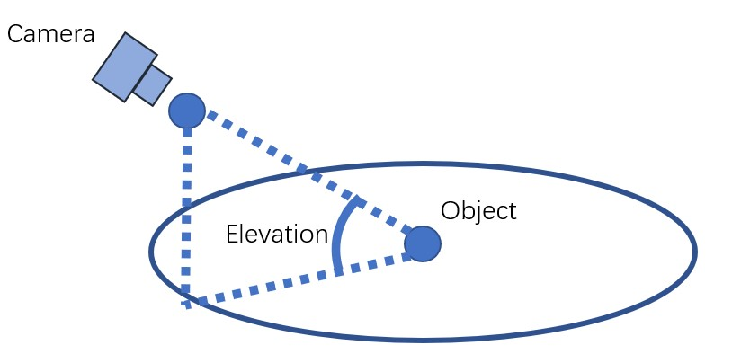
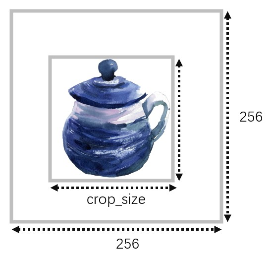

# SyncDreamer
SyncDreamer: Generating Multiview-consistent Images from a Single-view Image


## [Project page](https://liuyuan-pal.github.io/SyncDreamer/) | [Paper](https://arxiv.org/abs/2309.03453) | [Live Demo](https://huggingface.co/spaces/liuyuan-pal/SyncDreamer)

- [x] Inference code and pretrained models.
- [x] Training code.
- [x] Training data.
- [x] Evaluation code.
- [ ] New pretrained model without elevation as input

### News
- 2023-09-12: Training codes are released. We are still uploading the training data (about 1.6T) to onedrive, which would cost some time.
- 2023-09-09: Inference codes and pretrained models are released.

### Preparation for inference
1. Install packages in `requirements.txt`. We test our model on a 40G A100 GPU with 11.1 CUDA and 1.10.2 pytorch. But inference on GPUs with smaller memory (=10G) is possible.
```angular2html
conda create -n syncdreamer
conda activate syncdreamer
pip install -r requirements.txt
```
2. Download checkpoints [here](https://connecthkuhk-my.sharepoint.com/:f:/g/personal/yuanly_connect_hku_hk/EjYHbCBnV-VPjBqNHdNulIABq9sYAEpSz4NPLDI72a85vw).
3. A docker env can be found at [https://hub.docker.com/repository/docker/liuyuanpal/syncdreamer-env/general](https://hub.docker.com/repository/docker/liuyuanpal/syncdreamer-env/general).

### Inference
1. Make sure you have the following models.
```bash
SyncDreamer
|-- ckpt
    |-- ViT-L-14.ckpt
    |-- syncdreamer-pretrain.ckpt
```
2. (Optional) Predict foreground mask as the alpha channel. We use [Paint3D](https://apps.microsoft.com/store/detail/paint-3d/9NBLGGH5FV99) to segment the foreground object interactively. 
We also provide a script `foreground_segment.py` using `carvekit` to predict foreground masks and you need to first crop the object region before feeding it to `foreground_segment.py`. We may double check the predicted masks are correct or not.
```bash
python foreground_segment.py --input <image-file-to-input> --output <image-file-in-png-format-to-output>
```
3. Run SyncDreamer to produce multiview-consistent images.
```bash
python generate.py --ckpt ckpt/syncdreamer-pretrain.ckpt \
                   --input testset/aircraft.png \
                   --output output/aircraft \
                   --sample_num 4 \
                   --cfg_scale 2.0 \
                   --elevation 30 \
                   --crop_size 200
```
Explanation: 
- `--ckpt` is the checkpoint to load.
- `--input` is the input image in the RGBA form. The alpha value means the foreground object mask.
- `--output` is the output directory. Results would be saved to `output/aircraft/0.png` which contains 16 images of predefined viewpoints per `png` file. 
- `--sample_num` is the number of instances we will generate. `--sample_num 4` means we sample 4 instances from `output/aircraft/0.png` to `output/aircraft/3.png`.
- `--cfg_scale` is the *classifier-free-guidance*. `2.0` is OK for most cases. We may also try `1.5`.
- `--elevation` is the elevation angle of the input image in degree. As shown in the following figure,

- We assume the object is locating at the origin and the input image is captured by a camera with an elevation angle. Note we don't need a very accurate elevation angle but a rough value in [-10,40] degree is OK, e.g. {0,10,20,30}.
- `--crop_size` affects how we resize the object on the input image. The input image will be resize to 256\*256 and the object region is resized to `crop_size` as follows. `crop_size=-1` means we do not resize the object but only directly resize the input image to 256*256. 
`crop_size=200` works in most cases. We may also try `180` or `150`.
- 
- **Suggestion**: We may try different `crop_size` and `elevation` to get the best result. SyncDreamer does not always produce good results but we may generate multiple times with different `--seed` and select the most reasonable one.
- **Limited GPU memory**: For users with limited GPU memory, we may try `--sample_num 1` and `--batch_view_num 4`, which samples 1 instance and denoises 4 images on every step. This costs less than 10G GPU memory but is much slower in generation.
- [testset_parameters.sh](testset_parameters.sh) contains the command I used to generate results.
4. Run a NeuS or a NeRF for 3D reconstruction.
```bash
# train a neus
python train_renderer.py -i output/aircraft/0.png \
                         -n aircraft-neus \
                         -b configs/neus.yaml \
                         -l output/renderer 
# train a nerf
python train_renderer.py -i output/aircraft/0.png \
                         -n aircraft-nerf \
                         -b configs/nerf.yaml \
                         -l output/renderer
```
Explanation:
- `-i` contains the multiview images generated by SyncDreamer. Since SyncDreamer does not always produce good results, we may need to select a good generated image set (from `0.png` to `3.png`) for reconstruction.
- `-n` means the name. `-l` means the log dir. Results will be saved to `<log_dir>/<name>` i.e. `output/renderer/aircraft-neus` and `output/renderer/aircraft-nerf`.
- Before training, we will run `carvekit` to find the foreground mask in `_init_dataset()` in `renderer/renderer.py`. The resulted masked images locate at `output/renderer/aircraft-nerf/masked-*.png`. Sometimes, `carvekit` may produce incorrect masks.
- A rendering video will be saved at `output/renderer/aircraft-neus/rendering.mp4` or `output/renderer/aircraft-nerf/rendering.mp4`.
- We will only save a mesh for NeuS but not for NeRF, which is `output/renderer/aircraft-neus/mesh.ply`.

### Preparation for training

1. Generate renderings for training. We provide several objaverse 3D models as examples [here](https://connecthkuhk-my.sharepoint.com/:u:/g/personal/yuanly_connect_hku_hk/EQjz-dQRY4VLvIm8JTvQzi8BL58gatT6ewLJa54iVhsOZg?e=6TF0Vs). The whole objaverse dataset can be downloaded at [Objaverse](https://objaverse.allenai.org/).
To unzip the `random` dataset, we need to `cat z01 zip > zip` and then unzip the output file according to the description [here](https://www.bandisoft.com/bandizip.mac/howto/merge-split-zip/)
```bash
# generate renderings for fixed target views
blender --background --python blender_script.py -- \
  --object_path objaverse_examples/6f99fb8c2f1a4252b986ed5a765e1db9/6f99fb8c2f1a4252b986ed5a765e1db9.glb \
  --output_dir ./training_examples/target --camera_type fixed
  
# generate renderings for random input views
blender --background --python blender_script.py -- \
  --object_path objaverse_examples/6f99fb8c2f1a4252b986ed5a765e1db9/6f99fb8c2f1a4252b986ed5a765e1db9.glb \
  --output_dir ./training_examples/input --camera_type random
```
2. Organize the renderings like the following. We provide rendering examples [here](https://connecthkuhk-my.sharepoint.com/:u:/g/personal/yuanly_connect_hku_hk/EZEq7wDSR85IriRhO3bkW8wBNE9UtqH3lQ86dyAFdZqCRg?e=aRYDr9).
```bash
SyncDreamer
|-- training_examples
    |-- target
        |-- <renderings-of-uid-0>
        |-- <renderings-of-uid-1>
        |-- ...
    |-- input
        |-- <renderings-of-uid-0>
        |-- <renderings-of-uid-1>
        |-- ...
    |-- uid_set.pkl # this is a .pkl file containing a list of uids. Refer to `render_batch.py` for how I generate these files.
```
3. Download the pretrained zero123-xl model [here](https://zero123.cs.columbia.edu/assets/zero123-xl.ckpt).
4. The whole training set for SyncDreamer is [here](https://connecthkuhk-my.sharepoint.com/:f:/g/personal/yuanly_connect_hku_hk/EqrCp4rcFOFBuCatr88bkL0Bl3qKIEU1gSPS7TQ2KGb7Yg?e=eSESKA).


### Training
```bash
python train_syncdreamer.py -b configs/syncdreamer-train.yaml \
                           --finetune_from <path-to-your-zero123-xl-model> \
                           -l <logging-directory>  \
                           -c <checkpoint-directory> \
                           --gpus 0,1,2,3,4,5,6,7
```
Note in `configs/syncdreamer-train.yaml`, we specify the following directories which contain the training data and the validation data.  
```
target_dir: training_examples/target
input_dir: training_examples/input
uid_set_pkl: training_examples/uid_set.pkl
validation_dir: validation_set
```
During training, we will run validation to output images to `<log_dir>/<images>/val` every 1k steps.

### Evaluation
GT meshes and renderings for the GSO dataset can be found at [here](https://connecthkuhk-my.sharepoint.com/:f:/g/personal/yuanly_connect_hku_hk/EjYHbCBnV-VPjBqNHdNulIABq9sYAEpSz4NPLDI72a85vw).
1. Evaluate COLMAP reconstruction:
```shell
python eval_colmap.py --dir eval_examples/chicken-pr --project eval_examples/chicken-project --name chicken --colmap <path-to-your-colmap>
```
Note the 16 views are relatively very sparse for COLMAP so it sometimes fails to reconstruct.
2. Evaluate novel view synthesis, `pip install lpips` and
```shell
python eval_nvs.py --gt eval_examples/chicken-gt --pr eval_examples/chicken-pr 
```
3. Evaluate the mesh quality: install `pip install mesh2sdf` and install `nvdiffrast` [here](https://github.com/NVlabs/nvdiffrast). Then, 
```shell
python eval_mesh.py --pr_mesh eval_examples/chicken-pr.ply --pr_name syncdreamer --gt_dir eval_examples/chicken-gt --gt_mesh eval_examples/chicken-mesh/meshes/model.obj --gt_name chicken
```
Note we manually rotate the example when rendering. The rotations are listed in `get_gt_rotate_angle` in [eval_mesh.py](eval_mesh.py).

## Acknowledgement

We have intensively borrow codes from the following repositories. Many thanks to the authors for sharing their codes.

- [threestudio](https://github.com/threestudio-project/threestudio)
- [stable diffusion](https://github.com/CompVis/stable-diffusion)
- [zero123](https://github.com/cvlab-columbia/zero123)
- [COLMAP](https://colmap.github.io/)
- [NeuS](https://github.com/Totoro97/NeuS)
- [Magic123](https://github.com/guochengqian/Magic123)
- [RealFusion](https://github.com/lukemelas/realfusion)
- [One-2-3-45](https://github.com/One-2-3-45/One-2-3-45)

## Citation
If you find this repository useful in your project, please cite the following work. :)
```
@article{liu2023syncdreamer,
  title={SyncDreamer: Learning to Generate Multiview-consistent Images from a Single-view Image},
  author={Liu, Yuan and Lin, Cheng and Zeng, Zijiao and Long, Xiaoxiao and Liu, Lingjie and Komura, Taku and Wang, Wenping},
  journal={arXiv preprint arXiv:2309.03453},
  year={2023}
}
```
